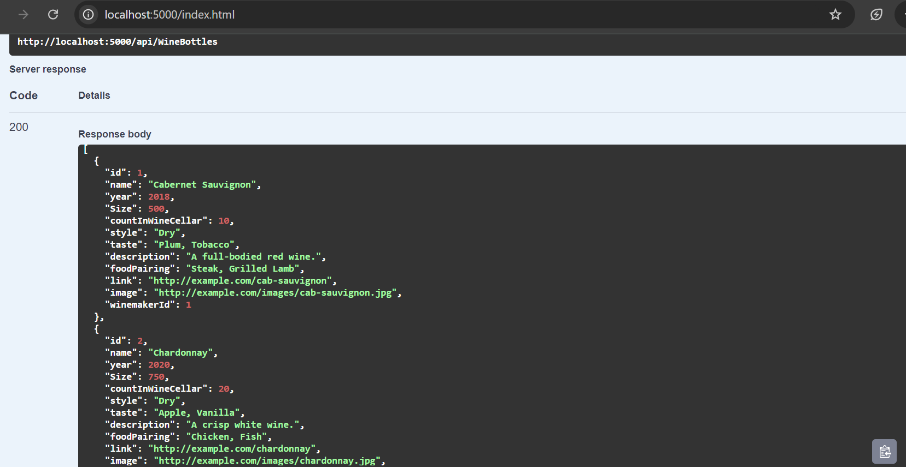
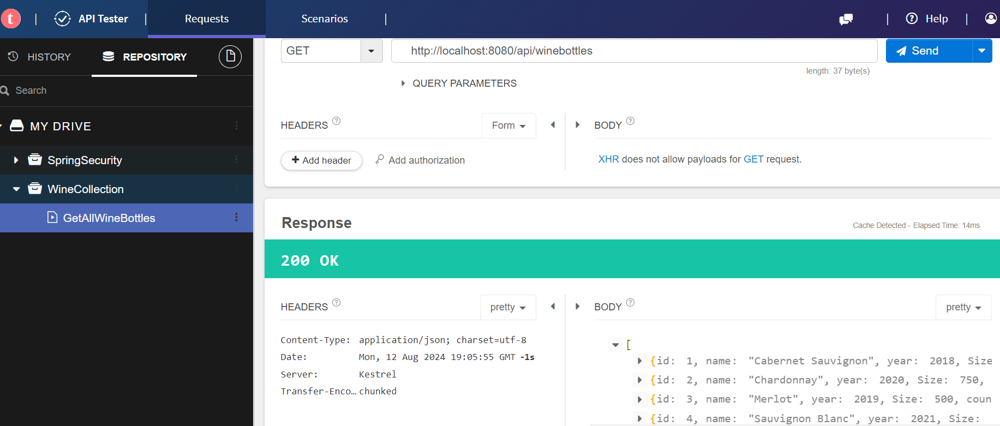

# Wine Collection Manager API

## Overview

The Wine Collection Manager API is a .NET 6.0 Web API application that manages a collection of wine bottles. It provides endpoints for performing CRUD operations on wine bottle records, including listing, filtering, adding, updating, and deleting wine bottles. The API is designed to be simple and easy to use, with a focus on providing a clear and consistent interface for managing wine data.

## Features

- **CRUD Operations**: Create, read, update, and delete wine bottle records.
- **Filtering**: Filter wine bottles based on various criteria such as size and year.
- **Error Handling**: Returns appropriate HTTP status codes and error messages for invalid requests.
- **Swagger Documentation**: Interactive API documentation provided via Swagger UI.
- **Docker Support**: Easily deploy and run the API using Docker.
- **Code Quality and Design**:
   - **Clean Code Principles**: Emphasize clean code principles such as KISS (Keep It Simple, Stupid) and DRY (Don't Repeat Yourself) to ensure the codebase is easy to understand, maintain, and extend.
   - **Single Responsibility Principle**: Implement methods and classes with the Single Responsibility Principle in mind to ensure they have a single reason to change, thereby avoiding unnecessary or over-engineering.
   - **SOLID Principles**: Adhere to SOLID principles to create a more modular, flexible, and maintainable codebase.

## Architecture

The API follows a clean architecture pattern with the following components:

- **Controllers**: Handle incoming HTTP requests and return appropriate responses.
- **Services**: Contain business logic and interact with data storage.
- **Models**: Define the data structures used by the API.
- **Data Access**: The service layer interacts with a data repository of sample mock data for testing purposes.

## Installation and Usage

### Option 1: Running Locally

1. **Clone the Repository**:
    ```bash
    git clone https://github.com/Mullu/WineCollectionManagerApi.git
    ```

2. **Navigate to the Project Directory**:
    ```bash
    cd WineCollectionManagerApi
    ```

3. **Build the Application**:
    ```bash
    dotnet build
    ```

4. **Run the Application**:
    ```bash
    dotnet run
    ```

The API will be available at `http://localhost:5000`.

Here is sample output from GetAllWineBottles endpoint


### Option 2: Running with Docker

1. **Ensure Docker is Installed**: Make sure Docker is installed on your machine.

2. **Build the Docker Image at the main project where Dockerfile is avaialable**:
    ```bash
    docker build -t wine-collection-manager-api .
    ```

3. **Run the Docker Container**:
    ```bash
    docker run -d -p 8080:80 wine-collection-manager-api
    ```

The API will be available at `http://localhost:8080`.

Here is sample output from GetAllWineBottles endpoint.



## Dependencies

The application relies on the following external libraries:

- **AutoMapper**: Used for mapping between models and data transfer objects.
- **FluentAssertions**: Provides fluent assertion syntax for unit tests.
- **Moq**: A mocking framework for unit testing.
- **Swashbuckle.AspNetCore**: Generates Swagger documentation for the API.
- **xunit**: A testing framework for .NET.

## Extra Features

The following extra feature enhancements to the solution can be done:

1. **Persistent Data Storage**:
   - **Database Integration**: Replace in-memory collections with a persistent data store (e.g., SQL Server) to save data between sessions. This transition will enable the application to handle real-world scenarios where data persistence is required.

2. **Enhanced Error Handling**:
   - **Granular Error Handling**: Implement more granular error handling and user-friendly error messages to cover various edge cases and improve the user experience.

3. **Performance Optimization**: 
   - **Filtering Logic Optimization**: Improve the query filtering logic.
   - **Memory Management**: Address potential memory leaks and inefficiencies in memory usage during operations.

4. **Authentication and Authorization**:
   - **Secure Endpoints**: Add authentication and authorization mechanisms to secure the API endpoints, ensuring that only authorized users can perform certain actions.

5. **Enhanced Handling and Edge Case Testing**:
   - **Edge Case Handling**: Consider more edge cases that may not be covered in the current implementation to ensure robustness.
   - **Expanded Test Coverage**: Increase test coverage to ensure the application is robust and free of bugs.

## Test Cases

- Unit test cases are added to cover various scenarios to ensure the functionality of the Wine Collection Manager API:

### Running Tests

1. **Navigate to the Test Project Directory from the main project**:
    ```bash
    cd WineCollectionManagerApiTests
    ```

2. **Run the test cases and verify the result**:
    ```bash
    dotnet test
    ```

## License

This project is licensed under the MIT License. See the LICENSE file for details.
